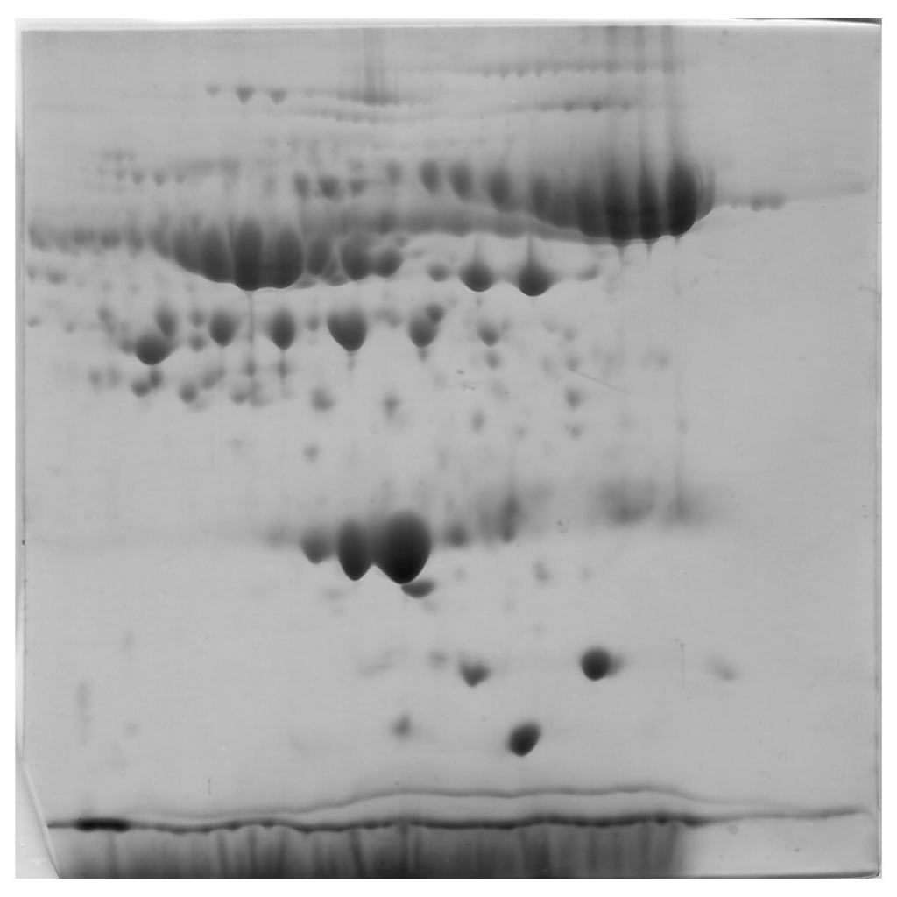
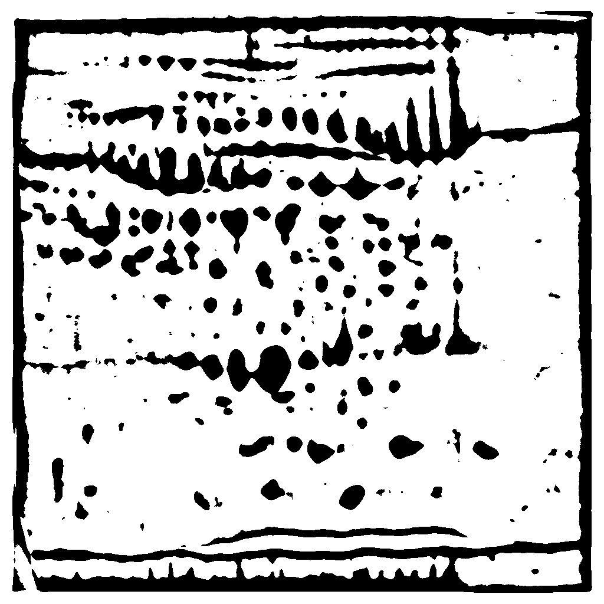
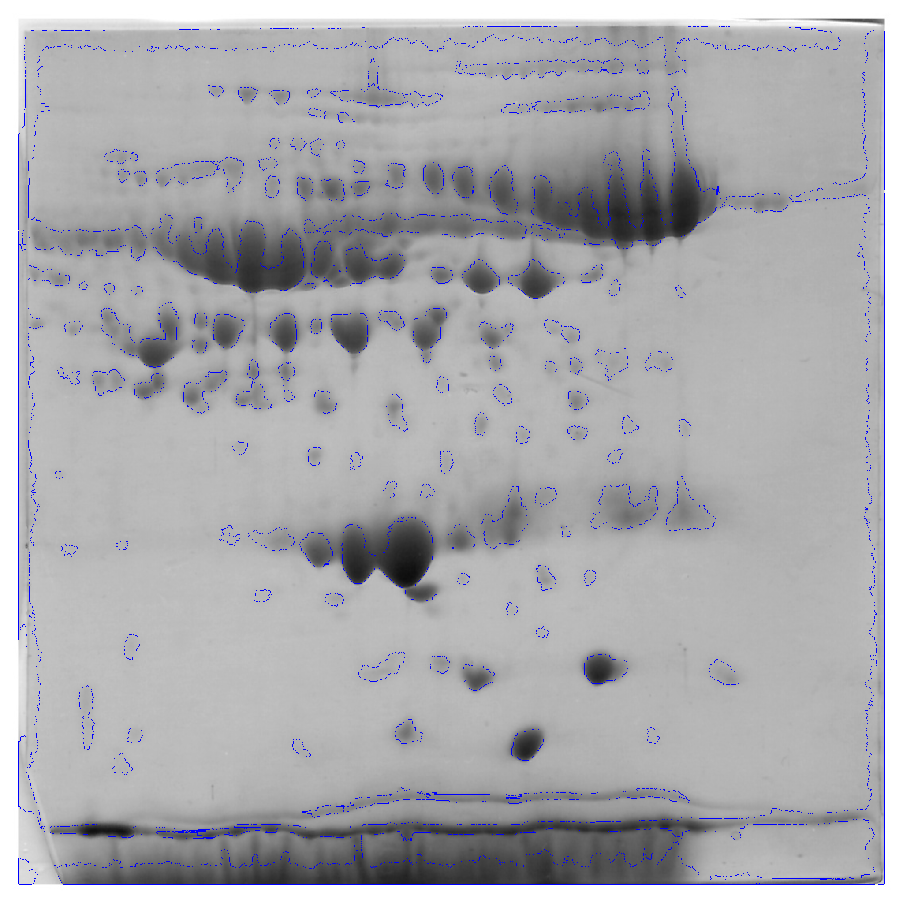

# 2de-processing

## Description
Final research project dedicated to the development of the web service that helps proteomics scientists fast and qualitatively process their 2DE images and upload final result to PNPI database

## Content

## Image Preprocessing
Implements now within `preprocessors/naive_detector.py` and includes next steps:

1. Import **TIFF** image
2. Normalize with CLAHE and bilateral noise filter
3. Define binary image to understand spots borders
4. Detect spots based on binary version using contour drawing
5. Draw defined spot contours on the original resized image

- Example of binarization of the image using naive methods:

Original                   |  Binary
:-------------------------:|:-------------------------:
  |  

- Example of naive detection:

Original                   |  Detected spots
:-------------------------:|:-------------------------:
  |  
